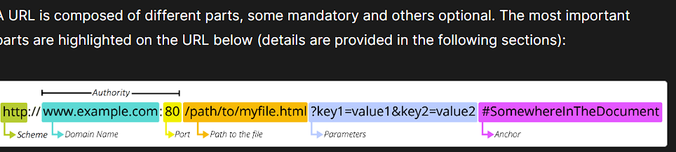

* # What is .then()?

***.then()*** is a method that is used to handle the result of a promise. A promise is like a container that holds a value that may not be available yet, but will be at some point in the future.

* ## How does .then() work? 

When you call a function that returns a promise, it's like sending a request to a restaurant to prepare a meal. 

The restaurant (the function) says, "Okay, I'll start preparing your meal, but it's going to take a few minutes. I'll let you know when it's ready."

The ***.then()*** method is like saying, "Okay, restaurant, when my meal is ready, please bring it to me and I'll do something with it."

#  WHAT ARE URL's

 A URL (Uniform Resource Locator) is the address of a unique resource on the internet. It is one of the key mechanisms used by browsers to retrieve published resources, such as HTML pages, CSS documents, images, and so on.

 

 Learn more [here!](https://developer.mozilla.org/en-US/docs/Learn/Common_questions/Web_mechanics/What_is_a_URL)